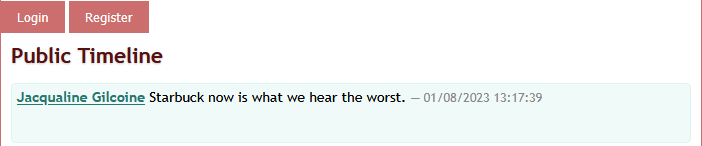
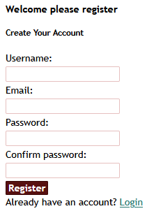
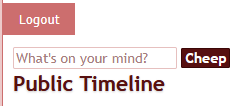

# Chirp!

---

## Welcome to Chirp!


`Chirp!` is a lightweight social media-like platform for sending and receiving `Cheeps`, Short messages for other Chirp users to read and respond to.

## Installation
### Prerequisites

Please make sure to have the following dependencies installed:

- `dotnet 8.0`
- `aspnet-runtime 8.0`
- `git`

### Clone the repository
Clone the project directly from the `github.com` repository page, via `Code->Download ZIP`.
Or clone the repo via git.

```
git clone https://github.com/ITU-BDSA2025-GROUP4/Chirp
```

### Launch

For launching `Chirp!`, navigate to `Chirp/src/Chirp.Web` and run

```
dotnet run
```

or run the subdirectory as an argument from the root directory

```
dotnet run --project src/Chirp.Web
```

If done correctly, the application will be served on localhost at port 5273. Copy the URL and paste it into your browser of choice.
```
localhost:5273
```

## Usage

Having launched Chirp! you should now be able to navigate the UI from your browser. You will first be met with the `Public Timeline`, showing all posts sorted by recency. Here you can either `register` as a new user, or `login` with an existing profile.



### Register

To register, fill out the provided form on the `Register` page.



### Login

To login, fill in the credentials from your existing account into the `login` form.


If done correctly, you should be logged in to your account.

### Post a Cheep!

Now you are free to post anything on your mind for the world to see!



Remember, you can log out at any time. Feel free to navigate the many posts on `Chirp!`. And remember, by clicking on a `username`, you can see that person's `Timeline`.

---

## Authors and Contributors

Authors of this project are

-  `augustlh`
-  `KumaSC`
-  `Mojjedrengen`
-  `RockRottenSalad`
-  `V0idshock`


Special thanks to the `ITU BDSA course team` and to all contributors of the project
 
## License
This program uses the MIT License - For further reading consult [LICENSE.md](LICENSE.md)
