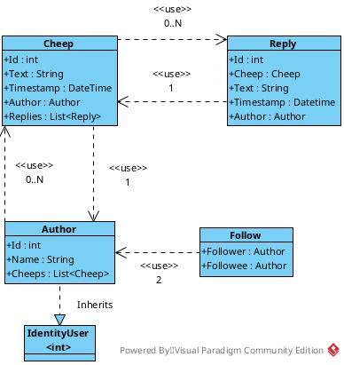

# Design and architecture
## Domain model

The domain model consists of 4 concrete classes and an abstract class which
stems from the .NET Identity library.

Users on the *Chirp!* platform are represented with the **Author** class. A
follow relationship between two users is represented using the **Follow**
class. The **Cheep** class represents messages an **Author** can make. Finally,
**Reply** is the class used for representing replies to messages.



## Architecture - in the small
## Architecture of deployed application
## User activities
## Sequence of functionality/calls through Chirp!

# Process
## Build, test, release, and deployment
## Team work

## How to make Chirp! work locally
Ensure that the following dependencies are installed.

`dotnet-runtime 8.0`
`asp-runtime 8.0`
`sqlite3`

Ensure that the database migrations are up to date by using the migration
helper script. For the migration_name, use anything that doesn't appear in
`src/Chirp.Infrastructure/Migrations`.
```
./scripts/migration.sh <MIGRATION_NAME>
```

Compile and run the razor app.
```
dotnet run --project src/Chirp.Web
```

## How to run test suite locally

The simplest way to run all unit tests is to simply execute the helper script
`scripts/run_all_tests.sh` like so.

```
./scripts/run_all_tests.sh
```

Alternatively, tests can be run individually by navigating to the appropriate
unit test directory inside the `test` directory and running the .NET test
command.

```
dotnet test
```

# Ethics
## License

This projects makes use of the MIT license.

## LLMs, ChatGPT, CoPilot, and others

