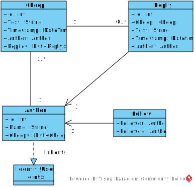
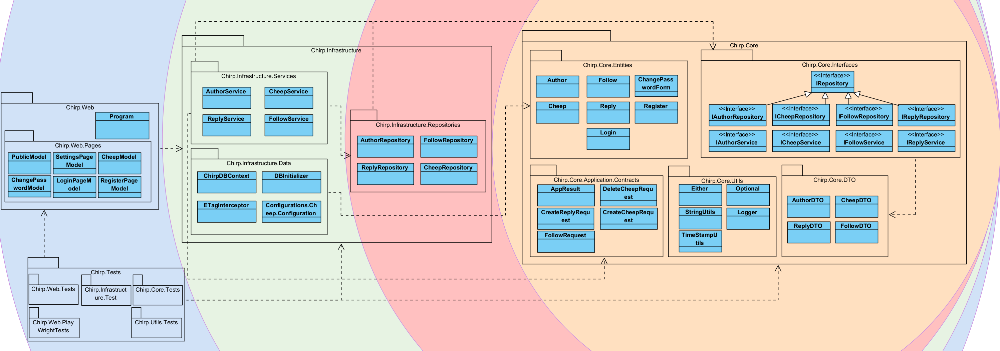
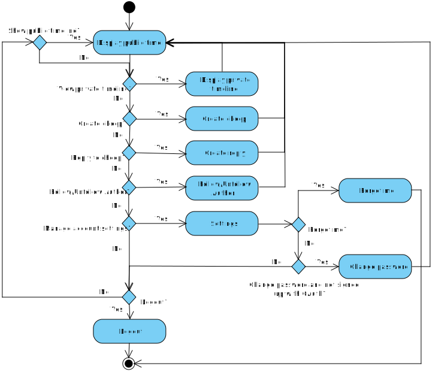
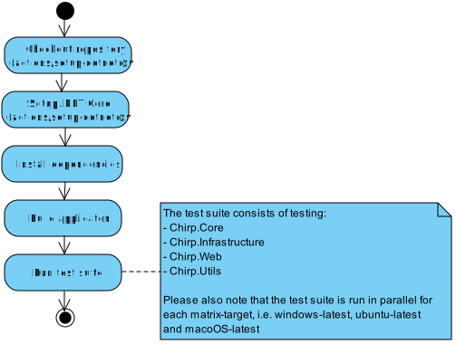
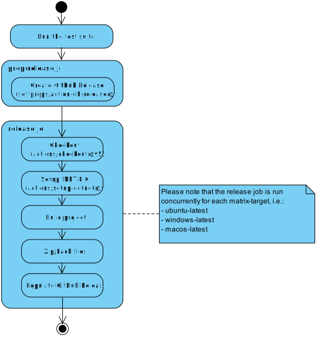
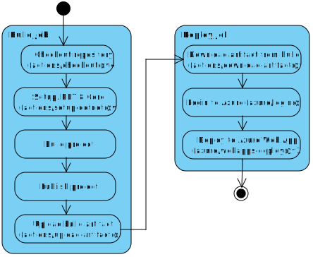
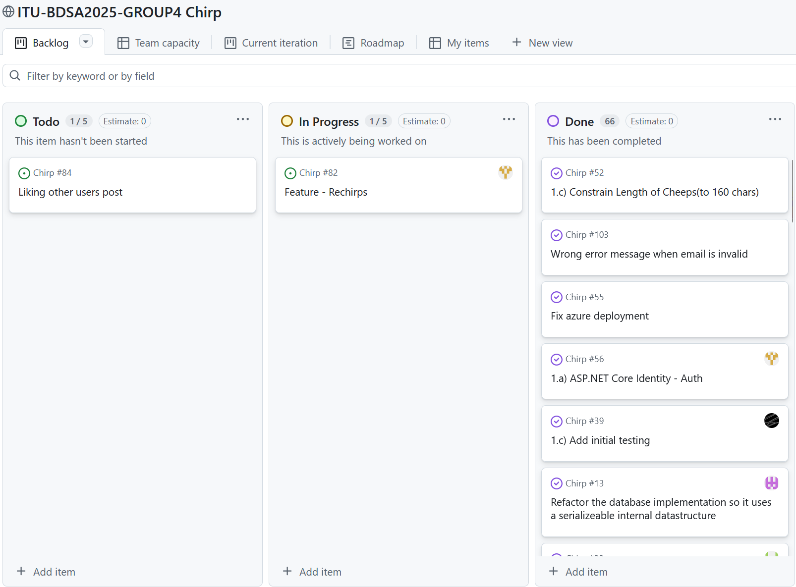
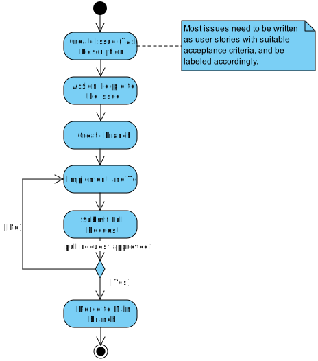

# Design and Architecture of _Chirp!_

## Domain model
The domain model comprises four concrete classes and one abstract base class derived from the ASP.NET Identity library. On the *Chirp!* platform, users are represented by the `Author` class. `Author` inherits from `IdentityUser`, which is part of the ASP.NET Identity library. Relationships where one `Author` follows another are represented by the `Follow` class. The `Cheep` class represents messages that an `Author` can make, while responses to those messages are modeled by the `Reply` class.



## Architecture - in the small
The project utilizes the onion architecture, and the codebase is organized accordingly. The organization of the code base can be seen in the diagram below:

\
*The innermost layer is the Domain layer, followed by the Repository layer and Services layer as one combined layer, and finally the UI layer.*

The distinction between the repository and service layers is not strictly enforced, resulting in some overlap of responsibilities. Since the repository and service layers overlap in responsibilities, they can be considered as a single combined layer, resulting in a three-layered diagram as seen above. Nonetheless, the architecture still adheres to the onion architecture in the sense that all dependencies point inwards.

As shown in the diagram above, `Chirp.Core` comprises the domain model, data transfer objects, domain interfaces, and other domain-specific objects. `Chirp.Infrastructure` contains the implementations of the domain interfaces in the form of loosely coupled services and repositories. It also contains the data model and database context. `Chirp.Web` contains the actual web application (the Razor Page application), which includes the web frontend and UI logic that utilizes the services implemented in `Chirp.Infrastructure`.

## Architecture of deployed application
The diagram below shows the deployment architecture of the application. The application follows a client-server architecture. The server component is a monolith deployed on Microsoft Azure. The server processes incoming requests, interacts with its integrated SQLite database, and sends back responses. The web browser component on the user's device acts as the client and is capable of exchanging requests and responses with the server over HTTPS, and rendering the received data to the user.


## User activities
For any Chirp! user, the entry point to the application is the root page, which displays the public timeline. This timeline shows all posted Cheeps sorted in order of the most recent cheeps first. Unauthorized users can browse the public timeline and view individual authors' timelines, but they are not able to interact with cheeps or authors in any way. To gain access to the rest of the features, users must authenticate by registering and/or logging in, as illustrated in the diagram below:


An authorized user is able to post cheeps, reply to cheeps and follow other authors. They are also able to view their own private timeline. The private timeline contains the users own cheeps, and cheeps from authors they have followed. Authorized users are also able to access their account settings, which allows them to change their password (if they are not signed up with OAuth) and deleting their account.



## Sequence of functionality/calls trough _Chirp!_
The diagram shows the request flow for the public Razor Page in ASP.NET Core. A user initiates a ``GET /`` request, which is routed through the ASP.NET Core middleware pipeline and dispatched to ``PublicModel.OnGetAsync()``. The page model retrieves data by calling the application service, which in turn queries the repository backed by the database. The resulting data is returned to the page model, the Razor view ``Public.cshtml ``is rendered, and the generated HTML is sent back to the user as a ``200 OK`` response.


# Process

## Build, test, release, and deployment
The application is built, tested, released, and deployed automatically using GitHub Actions workflows. These workflows are illustrated below in the UML activity diagrams. Please also note that if any step of a workflow fails during execution, the entire workflow is aborted. This is not illustrated in the diagrams, as it creates too much clutter.

The application is continuously built and tested whenever commits are pushed to branches or when pull requests attempt to merge into the main branch. This ensures that changes are constantly validated and bugs are caught early in the development process:



Commits tagged using the `x.y.z` format, trigger the release workflow. This workflow automatically tests the application on each major platform using the previous workflow. If all the tests succeed, releases are created for Windows, Linux, and MacOS:

 

The application is deployed to an Azure App Service when commits are pushed to the main branch:
 

## Team work
### Project board
The image below shows the GitHub project board used to make the status of development visible and transparent during this project:



As shown on the project board, most of the issues have been completed. The remaining issues concern the implementation of additional custom features that were identified as nice-to-haves during development but were not implemented.

### Development process
Our group follows a simple and structured development workflow from issue creation to feature integration. When a new issue (something that needs to be worked on) is identified, it is documented as an issue on GitHub in the format of a user story. The issue includes a clear task description, suitable acceptance criteria, and relevant labels. The issue is then assigned to one or more group members. The assigned developers then implement the required functionality and test it to verify that it meets the acceptance criteria. Once the work is completed, a pull request is opened against the main branch. Before the pull request is merged, it is automatically reviewed by CodeFactor and at least one team member. If the reviewer(s) approve the changes, the pull request is merged into the main branch. If any issues are identified during code review, the developers revise their implementation and repeat the testing and review process until it is approved. The flow can be seen in the activity diagram below:



## How to make _Chirp!_ work locally
### Prerequisites
The _Chirp!_ application has the following dependencies that must be installed for the application to run:
- `dotnet-runtime-8.0`
- `dotnet-sdk-8.0`
- `aspnet-runtime-8.0`

### Cloning the Repository
To run the application locally, first clone the repository.
One way to do this is by cloning it via HTTPS from the terminal:
```
git clone https://github.com/ITU-BDSA2025-GROUP4/Chirp.git
```

### Database Migrations
After cloning the repository, ensure that the database migrations are up to date. From the repository root, run the migration helper script. Use any migration name that does **not** already exist in `src/Chirp.Infrastructure/Migrations`.
```
./scripts/migration.sh <MIGRATION_NAME>
```

### Running the Application
The application can now be compiled and run using the following command from the repository root:
```
dotnet run --project src/Chirp.Web
```
The application will start listening on a local URL printed in the terminal. By default this is `localhost:5273`.

### GitHub OAuth
By default GitHub OAuth will **not** work locally because it requires secrets to be configured. To configure the secrets, one would navigate into the `Chirp.Web` directory, and execute the following commands:
```
dotnet user-secrets init
dotnet user-secrets set "AUTHGITHUBCLIENTID" "client-id"
dotnet user-secrets set "AUTHGITHUBCLIENTSECRET" "client-secret"
```
These secrets can naturally not be shared without exposing them to the entirety of GitHub, so to test out the functionality please visit the deployed web app on [https://bdsagroup4chirprazor.azurewebsites.net/](https://bdsagroup4chirprazor.azurewebsites.net/).

## How to run test suite locally
### Prerequisites
Some parts of the test suite rely on Playwright. Please ensure that Playwright is installed before running the tests.

### Running the tests
Assuming you have local copy of the application repository, the simplest way to run the test suite is to run the helper script from the repository root:
```
./scripts/run_all_tests.sh
```

You can also run tests individually by navigating to the relevant subdirectory within the test directory and running the .NET test command:
```
dotnet test
```

### Description of the test suite
The test suite consists of unit tests and integration tests, which are found within `test/Chirp.Core` and `test/Chirp.Infrastructure`. These tests ensure the correctness of core application logic and its interaction with infrastructure components. Additionally, the test suite contains end-to-end tests and UI tests, which are located in `test/Chirp.Web` and `test/Chirp.Web.PlayWrightTests`. These tests verify that the application functions correctly from a user's perspective.

# Ethics
## License
The project is licensed under the MIT license.

## LLMs, ChatGPT, CoPilot, and others
During the development of this project, several LLMs were used, namely `ChatGPT`, `GitHub Copilot` and `Google Gemini`. The models were used to support the development of the project, but not as substitutes for our own problem-solving, i.e., they were primarily used for suggesting implementations, clarifying syntax and language-specific features, and proposing alternative approaches to problems. GitHub Copilot was additionally used during code reviews as an automated tool that provided suggestions and caught bugs. When LLM-generated code was used, the involved LLMs were typically credited as co-authors in a relevant commit.

Overall, the responses from the LLMs were *moderately* helpful. While they rarely produced fully functional code that could be integrated into the project without modification, they were very effective at pointing development in the right direction and offering different perspectives on problems. In this capacity, the LLMs thus functioned as an on demand TA. This helped speed up the project’s development, as having a sparring partner who continuously provided feedback helped with solving problems more efficiently.
