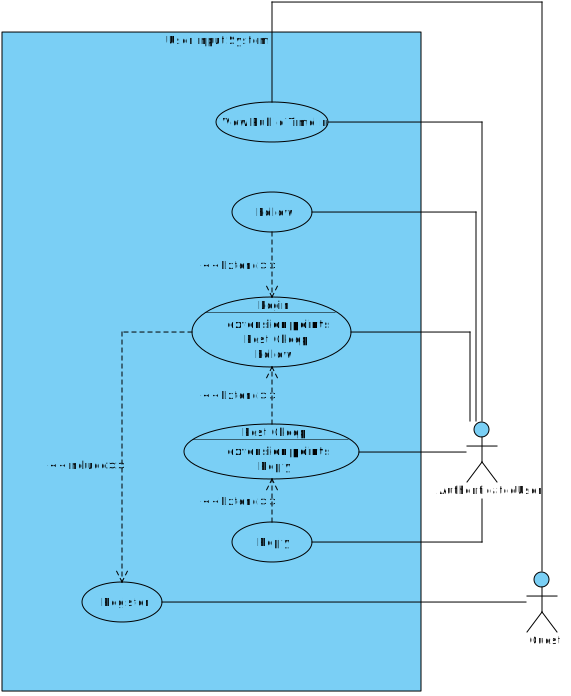

# Design and Architecture of _Chirp!_

## Domain model


## Architecture — In the small

## Architecture of deployed application
The diagram below shows the deployment architecture of the application. The application follows a client-server architecture. The server component is a monolith deployed on Microsoft Azure. The server processes incoming requests, interacts with its integrated database, and sends back responses. The web browser component on the user's device acts as the client and is capable of exchanging requests and responses with the server over HTTPS, and rendering the received data to the user.


## User activities

The typical start for any user of Chirp! will be the root `/` page (the standard public timeline), displaying all posted Cheeps sorted by recency. Access to different pages are determined by the user's authentication. 

A non-authenticated user can access pages `/Account/Register` and `/Account/Login` directly from the public timeline, allowing for their authentication via OAuth. They are still able to see all posted cheeps and view other author's timelines, but are not able to reply nor follow.

An authorized user will not see the Register and Login buttons, but will instead be able to post cheeps via the dedicated form, reply to cheeps and follow other authors, aswell as see other authors's timelines. They will also be able to view their own timeline via the `My Timeline` button in the navigation bar. Furthermore, the page `/Account/settings` will be available in navigation, allowing the change of account information, and the Forget-Me functionality. The logout button allows for the logout and invalidation of the session.

Below is the use case diagram of authorized and non-authorized (guest) users.


## Sequence of functionality/calls trough _Chirp!_

# Process

## Build, test, release, and deployment

## Team work

## How to make _Chirp!_ work locally
Ensure that the following dependencies are installed:
- `dotnet-runtime 8.0`
- `asp-runtime 8.0`
- `sqlite3`

## How to run test suite locally
The simplest way to run all unit tests is to simply execute the helper script
`scripts/run_all_tests.sh` like so.

```
./scripts/run_all_tests.sh
```

Alternatively, tests can be run individually by navigating to the appropriate
unit test directory inside the `test` directory and running the .NET test
command.

```
dotnet test
```

# Ethics
## License
The project is licensed under the MIT license.

## LLMs, ChatGPT, CoPilot, and others
During the development of this project, several LLMs were used, namely `ChatGPT`, `GitHub Copilot` and `Google Gemini`. The models were used to support the development of the project, but not as substitutes for our own problem-solving, i.e., they were primarily used for suggesting implementations, clarifying syntax and language-specific features, and proposing alternative approaches to problems. GitHub Copilot was additionally used during code reviews as an automated tool that provided suggestions and caught bugs. Additionally, the LLMs were used to generate CSS for the project.

Overall, the responses from the LLMs were *moderately* helpful. While they rarely produced fully functional code that could be integrated into the project without modification, they were very effective at pointing development in the right direction and offering different perspectives on problems. In this capacity, the LLMs thus functioned as a pair programmer or sparring partner. This helped speed up the project’s development, as having a sparring partner who continuously provided feedback helped with solving problems more efficiently.
